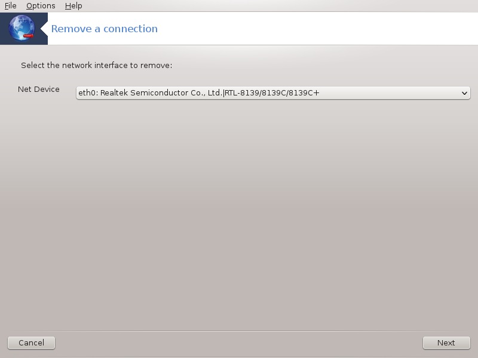

# Usuwanie połączenia

###drakconnect --del

Tutaj możemy usuwać interfejsy sieciowe.

Klikamy menu rozwijalne, wybieramy interfejs, który chcemy usunąć i klikamy **Dalej**.

Pokazana zostanie informacja o pomyślnym usunięciu interfejsu.

---
Narzędzie to można również uruchomić z linii komend za pomocą polecenia:
**drakconnect --del** wykonanego jako root.
